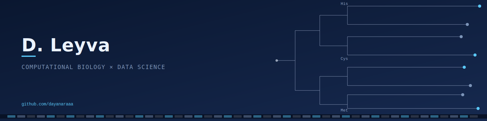

    

<h1 align="center">About me </h1>

Data Science student (Bioinformatics stream) at Durham University with a background in biological sciences and research experience in protein sequence analysis, machine learning, and structural bioinformatics.

I focus on computational approaches to biological data, with an emphasis on machine learning and reproducible data analysis workflows.

---

<h2 align="center">Research Focus</h2>

Protein sequence feature analysis for prediction tasks 
Bioinformatics pipelines for sequence alignment and phylogenetics 
Machine learning applications in computational biology

---

<h2 align="center">Core Tools & Skills</h2>

 Python •
 R •
 Bash/Linux •
 scikit-learn •
 pandas •
 NumPy

---
<h2 align="center">Contact</h2>

  

  

